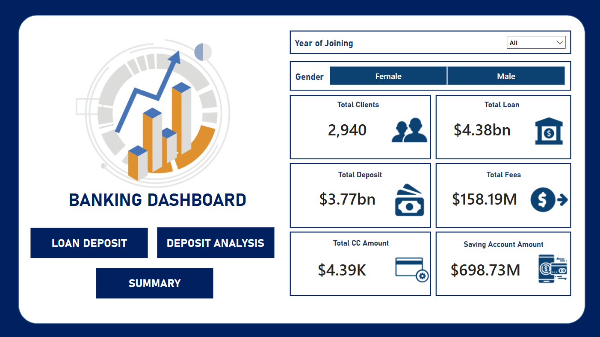

## 🏦 Banking Risk‐Analytics Dashboard (Power BI)

**Problem Statement**  
Develop a foundational risk-analytics solution for banking & financial services that leverages client data to minimize credit-loss when approving loans.

**Solution Overview**  
Our Power BI dashboards enable underwriters and risk teams to evaluate borrower profiles and make data-driven lending decisions. By surfacing borrower tenure, income bands, outstanding balances and fee structures, stakeholders can quickly identify low- versus high-risk applicants.

---

### 🧹 Data Preparation & Cleaning

1. **Engagement Timeframe**  
   - New column in Client-Banking: tenure category (e.g. “New”, “Established”)  
2. **Engagement Days**  
   - `DATEDIFF([Joined Bank], TODAY(), DAY)`  
3. **Income Band**  
   - Bins on Estimated Income:  
     - `< 100 000 → Low`  
     - `< 300 000 → Mid`  
     - `≥ 300 000 → High`  
4. **Processing Fees**  
   - Derived from Fee Structure:  
     - `High → 5%`  
     - `Mid → 3%`  
     - `Low → 1%`  

---

### 🔢 Key DAX Measures

| Measure Name          | Calculation                                                                 |
|-----------------------|------------------------------------------------------------------------------|
| **Total Clients**     | `DISTINCTCOUNT('Clients-Banking'[Client ID])`                                |
| **Total Loan**        | `[Bank Loan] + [Business Lending] + [Credit Cards Balance]`                  |
| **Bank Loan**         | `SUM('Clients-Banking'[Bank Loans])`                                         |
| **Business Lending**  | `SUM('Clients-Banking'[Business Lending])`                                   |
| **Total Deposit**     | `[Bank Deposit] + [Savings Account] + [Foreign Currency Account] + [Checking Accounts]` |
| **Total Fees**        | `SUMX('Clients-Banking', [Total Loan] * [Processing Fees])`                  |
| **Engagement Days**   | `DATEDIFF('Clients-Banking'[Joined Bank], TODAY(), DAY)`                     |

---

### 📊 Dashboards & KPIs

1. **Home / Summary**  
   - High-level cards: Total Clients, Total Loan, Total Deposit, Average Income Band  
   - Trend line: Loans vs. Deposits over time  

2. **Loan Analysis**  
   - Bar by Gender, Advisor, Income Band  
   - KPI variance vs. prior period  

3. **Deposit Analysis**  
   - Matrix of deposit types by client segment  
   - Conditional formatting to flag low balances  

4. **Risk Profile**  
   - Scatter: Engagement Days vs. Total Loan  
   - Income Band distribution by default risk tier  

---

### ⚙️ UX Enhancements

- **Slicers:** Date, Gender, Advisor, Income Band  
- **Dynamic Titles:** Reflect selected segment & period  
- **Bookmarks:**  
  - _“Reset Filters”_ button  
  - _“Data Dictionary”_ pop-up explaining tables & fields  
- **Export:** Raw-data download via Power Automate

---

### 🚀 Future Work

- Integrate credit-score external API for enhanced risk scoring  
- Add predictive model outputs (PD / LGD) using Azure ML  
- Geographic heat-map of default rates by branch  

---

## Overview Dashboard

*© 2025 Akash Patel. All rights reserved.*  

